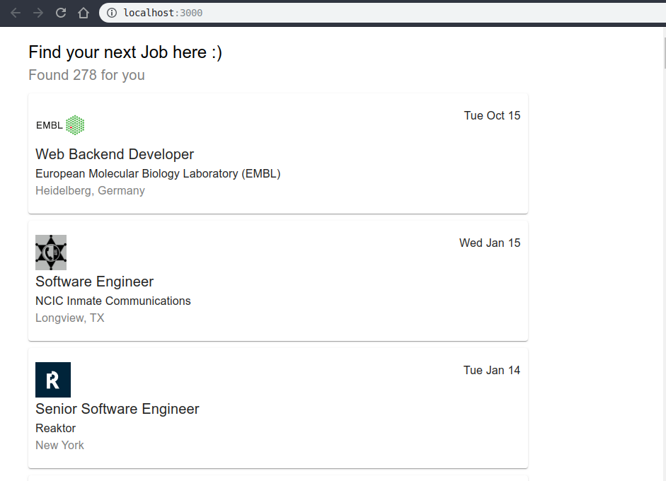
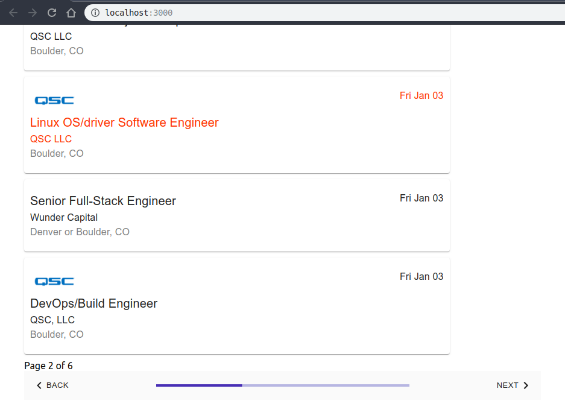
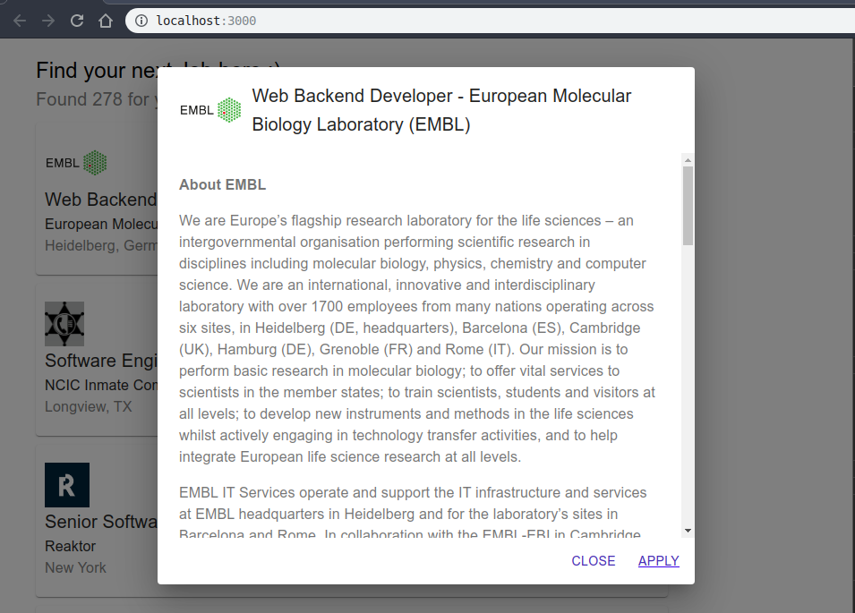

A Javascript based web app to show the list of jobs posted on Github using Redis, React and NodeJS with Express

``git clone https://github.com/dineshnadimpalli/findMyJob.git``

``cd findMyJob``

``npm install``

``cd ../client``

``npm install``

In one terminal start the frontend

``npm start``

In another terminal start the backend from root directory

``node api/index.js``

In third terminal start a cron job from root directory to fetch the data at continuous intervals

``node worker/index.js``

The frontend will now automatically run on port http://localhost:3000

Here are the sample pictures of how the app should look once you successfully clone it and run.

  

  

  

